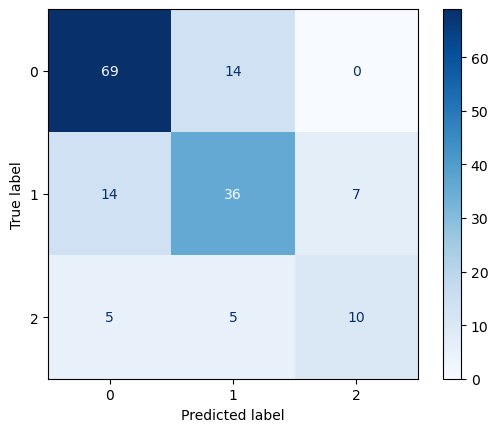
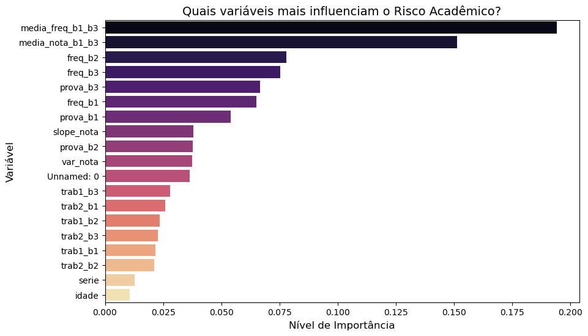

# 🎓 Sistema de Predição de Risco de Reprovação em Matemática com Machine Learning


[](https://www.python.org/)
[](https://scikit-learn.org/)

---

## 📌 Visão Geral
Este projeto desenvolve uma solução completa de ciência de dados para identificar alunos com risco de reprovação na disciplina de matemática. A solução abrange desde a simulação de dados educacionais realistas até a criação de um modelo preditivo de alta performance e um dashboard para tomada de decisão pedagógica.

Utilizando dados de notas e frequência até o fim do terceiro bimestre, o sistema classifica os estudantes em três categorias finais:

- 🟢 **Aprovado**
- 🟡 **Recuperação**
- 🔴 **Reprovado**

A grande vantagem deste projeto está na antecipação do risco: a previsão é realizada ao final do 3º bimestre, permitindo que a escola atue preventivamente no último período do ano letivo por meio de intervenções pedagógicas orientadas por dados.

---

## 📚 Índice
1. [Pipeline do Projeto](#-pipeline-do-projeto)  
2. [Objetivo](#-objetivo)  
3. [Dados e Dicionário de Dados](#-dados)  
4. [Engenharia de Atributos e Desafios Técnicos](#-engenharia-de-atributos-e-desafios-técnicos)  
5. [Modelos e Avaliação](#-modelos-e-avaliação)  
6. [Interpretação dos Resultados](#-interpretação-dos-resultados)  
7. [Score de Risco e Dashboard](#-score-de-risco-e-dashboard)  
8. [Estrutura do Repositório](#-estrutura-do-repositório)  
9. [Como Executar](#-como-executar)  
10. [Resultados e Próximos Passos](#-resultados-e-próximos-passos)  

---

## 🔄 Pipeline do Projeto
1. Geração de dados sintéticos acadêmicos  
2. Análise exploratória e engenharia de atributos  
3. Treinamento e avaliação de modelos de classificação  
4. Geração de score de risco e visualização gerencial  

---

## 2️⃣ Objetivo
Desenvolver um sistema de previsão de risco acadêmico capaz de identificar, ao final do 3º bimestre, alunos com maior probabilidade de:

- 🟢 Aprovação  
- 🟡 Recuperação  
- 🔴 Reprovação  

Permitindo a implementação de ações pedagógicas direcionadas no último bimestre do ano letivo.

---

## 3️⃣ Dados
Os dados utilizados são sintéticos, gerados para fins educacionais e de demonstração do pipeline completo de Data Science aplicado ao contexto escolar.

### Estrutura de Avaliação (Matemática)
- 1 prova (máx: 8 pontos)  
- 2 trabalhos (máx: 1 ponto cada)  
- Frequência percentual no bimestre  

**Nota máxima por bimestre:** 10 pontos  
**Nota final:** média das quatro notas bimestrais  
**Frequência final:** percentual total de presença no ano  

### Regras de Aprovação
| Classe        | Condição                                      |
|---------------|-----------------------------------------------|
| Aprovado      | nota_final ≥ 7 **e** frequência ≥ 75%         |
| Recuperação   | 5 ≤ nota_final < 7 **e** frequência ≥ 75%     |
| Reprovado     | nota_final < 5 **ou** frequência < 75%        |

### Dicionário de Dados

#### 🔹 Variáveis Originais
| Variável | Descrição | Tipo |
| :--- | :--- | :--- |
| `id_aluno` | Identificador único do estudante | Inteiro |
| `serie` | Série ao qual o aluno pertence | Inteiro |
| `idade` | Idade do aluno | Inteiro |
| `prova_b1`, `prova_b2`, `prova_b3`, `prova_b4` | Nota da prova de cada bimestre (máx: 8 pontos) | Float |
| `trab1_b1`, `trab2_b1`, ..., `trab1_b4`, `trab2_b4` | Notas dos dois trabalhos por bimestre (máx: 1 ponto cada) | Float |
| `freq_b1`, `freq_b2`, `freq_b3`, `freq_b4` | Frequência percentual por bimestre (0–100%) | Float |
| `nota_b1`, `nota_b2`, `nota_b3`, `nota_b4` | Nota total por bimestre (prova + trabalhos) | Float |
| `nota_final` | Média das quatro notas bimestrais | Float |
| `frequencia_final` | Média da frequência anual | Float |
| `resultado_final` | Classificação final do aluno: Aprovado, Recuperação ou Reprovado | Texto |

#### 🔹 Variáveis Derivadas (Engenharia de Atributos)
| Variável | Descrição | Tipo |
| :--- | :--- | :--- |
| `media_no` | Média das notas dos bimestres 1 a 3 | Float |
| `media_fre` | Média da frequência dos bimestres 1 a 3 | Float |
| `slope_nota` | Tendência de evolução das notas ao longo dos bimestres | Float |
| `var_nota` | Variância das notas nos bimestres 1 a 3 | Float |
| `prob_repr`, `prob_recu`, `prob_apr` | Probabilidade predita de reprovação, recuperação ou aprovação | Float |
| `score_risc` | Score de risco acadêmico (0–100) | Float |
| `nivel_risc` | Nível de risco categorizado: Baixo, Moderado ou Alto Risco | Texto |


---

## 4️⃣ Engenharia de Atributos e Desafios Técnicos
- Criação de variáveis agregadas como `media_nota_b1_b3` e `media_freq_b1_b3`, as quais foram mais informativas que notas isoladas.  
- Desbalanceamento de classes tratado com `class_weight='balanced'`.  
- Ajuste de hiperparâmetros (ex.: `max_iter` na Regressão Logística) para garantir convergência.  

---

## 5️⃣ Modelos e Avaliação
Foram comparados os modelos de Regressão Logística e Random Forest, avaliados por meio de validação cruzada K-Fold.

| Modelo              | F1-Score (Macro) | Acurácia |
|---------------------|------------------|----------|
| Regressão Logística | 0.69             | 0.70     |
| Random Forest       | 0.66             | 0.72     |

Os resultados mostram que ambos os modelos apresentaram desempenho semelhante, com valores próximos de acurácia e F1-score macro.  
A Regressão Logística demonstrou maior equilíbrio entre as classes, sendo ligeiramente superior na identificação de alunos em risco, enquanto o Random Forest apresentou acurácia marginalmente maior, mas sem ganhos consistentes em termos de generalização.  

A matriz de confusão da Regressão Logística mostra que alguns alunos em risco (classes 0 e 1) foram previstos como aprovados (classe 2), o que representa um erro mais crítico. Já no Random Forest, esse tipo de erro foi menos frequente, embora o modelo tenha apresentado menor equilíbrio entre as classes.



![Matriz de Confusão Regressão Logística] (./figures/matriz_confusao_regressao.png)
Embora o Random Forest tenha cometido menos erros graves ao não classificar alunos em risco (reprovados ou em recuperação) como aprovados, a Regressão Logística foi escolhida como modelo final. Essa decisão se deve à sua simplicidade, eficiência computacional, interpretabilidade e melhor capacidade de tratar o desbalanceamento das classes.  

Na prática pedagógica, é fundamental compreender os fatores que levam ao risco acadêmico, e a Regressão Logística permite maior transparência na análise das variáveis. Além disso, apesar das métricas globais serem próximas, a regressão logística mostrou-se mais eficiente e consistente, tornando-se a opção preferível para apoiar a tomada de decisão da escola.

---

## 6️⃣ Interpretação dos Resultados

Gráfico das importâncias de cada variável  


- ✔ `media_freq_b1_b3` foi identificado como o principal preditor, confirmando a frequência acumulada como fator crítico.  
- ✔ `media_nota_b1_b3` aparece como segundo indicador mais relevante, mostrando que o desempenho consolidado é mais útil do que notas pontuais.  
- ✔ Frequências individuais por bimestre também tiveram grande influência, reforçando a importância da assiduidade.  
- ✔ Provas e trabalhos isolados apresentaram menor impacto, enquanto idade e série mostraram pouca relevância.  

De forma geral, os resultados reforçam que o risco acadêmico está mais associado ao desempenho consolidado ao longo dos três primeiros bimestres — representado pelas médias de notas e frequência — do que a avaliações isoladas.  
A frequência escolar se destacou como forte preditor, mas isso se deve em grande parte ao fato de ser um critério institucional de aprovação, funcionando como um “atalho” para o modelo. Esse achado sugere que intervenções pedagógicas voltadas para melhorar a assiduidade desde os primeiros bimestres podem ser mais eficazes do que ações focadas apenas na recuperação de notas baixas no final do ano.  

### Comparação dos Modelos
- A **Regressão Logística** apresentou métricas similares ao Random Forest, mas foi escolhida como modelo final por sua simplicidade, interpretabilidade e maior equilíbrio entre as classes.  
- O **Random Forest** destacou variáveis individuais, como a nota do 3º bimestre, como fortes indicadores de risco, oferecendo insights úteis para intervenções pedagógicas precoces.  

Assim, cada modelo contribuiu de forma distinta: a regressão logística como ferramenta pedagógica mais transparente e equilibrada, e o Random Forest como apoio complementar para identificar padrões não lineares e variáveis pontuais de risco.

### Comparação dos modelos
- A **Regressão Logística** apresentou métricas similares ao Random Forest, mas foi escolhida como modelo final por sua simplicidade e eficiência computacional.  
- O **Random Forest** destacou variáveis individuais, como a nota do 3º bimestre, como fortes indicadores de risco, oferecendo insights úteis para intervenções pedagógicas precoces.  

De forma geral, os resultados reforçam que o risco acadêmico está mais associado ao desempenho consolidado ao longo dos três primeiros bimestres — representado pelas médias de notas e frequência — do que a avaliações isoladas. 
A frequência escolar se destacou como um forte preditor, mas isso se deve em grande parte ao fato de ser um critério institucional excludente para aprovação, funcionando como um “atalho” para o modelo. 
Esse achado sugere que intervenções pedagógicas voltadas para melhorar a assiduidade desde os primeiros bimestres podem ser mais eficazes do que ações focadas apenas na recuperação de notas baixas no final do ano. 
Por outro lado, variáveis como idade, série e trabalhos tiveram pouca relevância, indicando que seu impacto na previsão de reprovação é limitado. 
Assim, o modelo contribui como uma ferramenta de apoio à decisão, permitindo identificar alunos em risco ainda no 3º bimestre e direcionar estratégias pedagógicas de forma antecipada e baseada em dados.

Por fim, conclui-se que o modelo sugere que intervenções baseadas na assiduidade desde o segundo bimestre podem ser mais eficazes para prevenir o risco acadêmico do que focar apenas na recuperação de notas baixas no final do ano. A frequência se destaca como critério institucional excludente, funcionando como forte indicador de reprovação.


### Conclusão Pedagógica
O modelo sugere que para aumentar os índices de aprovação, a coordenação pedagógica deve focar primariamente em garantir que os alunos tenham assiduidade necessária. Ou seja, é crucial que os alunos frequentem o mínimo necessário de aulas durante o ano.
Ademais, a nota consolidadada dos três primeiros bimestres também atua como um indicador forte da aprovação dos alunos, desse modo é importante investir em práticas que mantenham a constância de boas notas dos alunos afim de obterem uma boa média ao fim do terceiro bimestre.


---
## 7️⃣ Score de Risco e Dashboard

O modelo final gera um score de risco acadêmico por aluno, permitindo a segmentação em **Baixo**, **Moderado** e **Alto Risco**.


📄 **Dashboard (PDF):**  
`dashboard/risco_academico_dashboard.pdf`

Embora a Regressão Logística tenha sido escolhida como modelo final para análise pedagógica, o **Random Forest** foi utilizado na etapa de geração dos scores por oferecer maior robustez probabilística e melhor separação entre as classes. Essas características tornam o modelo mais adequado para uso operacional em dashboards e apoio à tomada de decisão pedagógica.

O dashboard apoia a coordenação pedagógica na:  
- Identificação de alunos prioritários  
- Análise de frequência e desempenho  
- Planejamento de intervenções acadêmicas  
---

## 📂 Estrutura do Repositório
```text
Previsao_Risco_Academico/
│
├── README.md
├── data/
│   ├── raw/
│   │   └── dados_academicos.csv
│   └── processed/
│       ├── dados_academicos_processados.csv
│       └── dados_dashboard_final.csv
│       └── dados_dashboard_final.xls
├── notebooks/
│   ├── 01_data_generation.ipynb
│   ├── 02_eda_and_feature_engineering.ipynb
│   ├── 03_modeling_and_evaluation.ipynb
│   └── 04_risk_scoring_and_outputs.ipynb
├── dashboard/
│   └── Dashboard_risco_reprovacao_matematica.pdf
│   └── figures/
│       ├── visao_geral.png
│       └── perfil_risco.png
│       ├── matriz_confusao_random_forest.png
│       └── matriz_confusao_regressao.png
├── figures/
│   └── perfil_risco.png
│   └── visao_geral.png
│
└── requirements.txt
```
---

## 🚀 Como Executar

**Clone o repositório:**
git clone https://github.com/PauloVBernardo/Previsao_Risco_Academico.git
cd Previsao_Risco_Academico

**Instale as dependências:**
pip install -r requirements.txt

**Execute os notebooks na ordem numérica.**

## ✅ Status do Projeto e Próximos Passos
Status: Finalizado. 

### Possíveis melhorias:
- Explorar modelos adicionais (XGBoost, LightGBM).  
- Investigar de forma mais aprofundada a relação entre frequência e notas, para maior valor pedagógico.  
- Implementar versão interativa do dashboard em Power BI Service.  

Essas melhorias não comprometem o status atual do projeto, mas representam oportunidades futuras de expansão e refinamento da solução.

---
## 📬 Contato
👤 Autor: Paulo Vitor dos Santos Bernardo
📧 Email: pauloviti@gmail.com
🔗 LinkedIn: www.linkedin.com/in/paulo-vitor-bernardo
